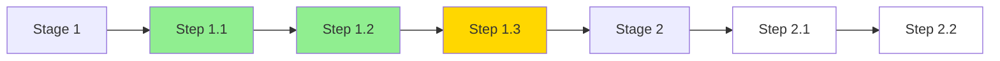
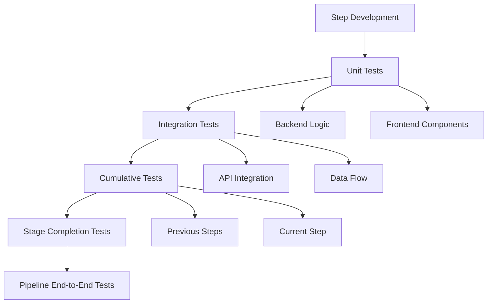

# Integrated Pipeline Development Methodology (IPDM)
## A Stage-Sequential, Step-Atomic Approach for Bright Run LoRA Training Platform

**Version:** 1.0.0  
**Date:** 2025-01-23  
**Product:** Bright Run LoRA Fine-Tuning Training Data Platform  
**Abbreviation:** BMO-IPDM

---

## Executive Summary

The Integrated Pipeline Development Methodology (IPDM) addresses the fundamental disconnect between backend functionality and user experience by developing features as **complete vertical slices** through the application stack. Each development unit represents a single, testable step in the pipeline that delivers immediate user value.

### Core Principles
1. **Vertical Integration**: Each step includes backend + frontend + testing as an atomic unit
2. **Sequential Pipeline Development**: Build stages in order, steps within stages in order
3. **Live Development**: All components built in production locations, tested in place
4. **Cumulative Testing**: Each new step validates all previous functionality
5. **User-Centric Functionality**: Every backend feature has a corresponding user interaction

---

## Problem Analysis

### Current Development Gaps

#### Backend-First Problems
- **Invisibility**: Engine features have no human touchpoint
- **Assumption Drift**: Technical solutions diverge from user needs
- **Integration Debt**: Retrofitting UI to existing engines creates friction
- **Testing Blindness**: Cannot validate user experience until late in development

#### UI-First Problems
- **Functionality Mismatch**: Frontend assumes backend capabilities that don't exist
- **Rework Cycles**: UI must be rebuilt when backend reality differs from assumptions
- **Mock Data Trap**: Testing with mocks hides integration issues
- **Feature Creep**: UI suggests features that backend cannot efficiently deliver

### Root Cause
**The fundamental issue is temporal separation** - building backend and frontend at different times creates:
- Context loss between development phases
- Assumptions that drift from reality
- Integration challenges that compound over time
- Quality issues from retrofitting rather than co-designing

---

## IPDM Solution Architecture

### Development Unit: The Pipeline Step

Each **Pipeline Step** is the atomic unit of development, containing:

```yaml
Pipeline Step:
  Backend:
    - Data Models (if needed)
    - API Endpoints (specific to step)
    - Business Logic (step-specific only)
    - Database Operations (step-specific)
    - File/Storage Operations (if needed)
  
  Frontend:
    - UI Components (production location)
    - State Management (for this step)
    - API Integration (connects to backend)
    - User Interactions (complete flow)
    - Visual Feedback (loading, errors, success)
  
  Testing:
    - Backend Unit Tests (in place)
    - Frontend Component Tests (in place)
    - Integration Tests (frontend + backend)
    - User Flow Tests (cumulative with previous steps)
    - Data Validation Tests
```

### Development Sequence



Legend:
- 🟢 Green: Completed and tested
- 🟡 Yellow: In development
- ⚪ White: Not started

---

## Implementation Framework

### Phase 1: Pipeline Mapping

#### Stage Definition
Based on the six-stage workflow from the functional requirements:

```yaml
Pipeline Stages:
  Stage 1 - Knowledge Ingestion:
    Steps:
      1.1: File Upload Interface & Processing
      1.2: Text Input & Validation
      1.3: Content Preview & Confirmation
  
  Stage 2 - Content Analysis:
    Steps:
      2.1: Topic Extraction Display
      2.2: Entity Recognition Interface
      2.3: Knowledge Structure Visualization
  
  Stage 3 - Training Pair Generation:
    Steps:
      3.1: Q&A Pair Creation Interface
      3.2: Conversation Generation Controls
      3.3: Training Pair Preview & Edit
  
  Stage 4 - Semantic Variation:
    Steps:
      4.1: Variation Parameters Configuration
      4.2: Variation Generation & Display
      4.3: Variation Quality Assessment
  
  Stage 5 - Quality Assessment:
    Steps:
      5.1: Automated Quality Metrics Display
      5.2: Manual Review Interface
      5.3: Quality Improvement Controls
  
  Stage 6 - Export & Deployment:
    Steps:
      6.1: Format Selection & Configuration
      6.2: Export Generation & Download
      6.3: Training Platform Integration
```

### Phase 2: Step Development Process

#### For Each Step (e.g., Step 1.1: File Upload)

##### A. Backend Development (2-3 hours)
```typescript
// Location: src/app/api/pipeline/stage1/upload/route.ts
export async function POST(request: Request) {
  // 1. File validation logic
  // 2. Storage operations
  // 3. Database record creation
  // 4. Response with processing status
}

// Location: src/lib/services/pipeline/stage1/file-processor.ts
export class FileProcessor {
  // Actual file processing logic
  // PDF, DOCX, TXT parsing
  // Content extraction
}

// Location: prisma/schema.prisma (if needed)
model UploadedFile {
  id        String   @id
  filename  String
  content   String
  status    Status
  createdAt DateTime
}
```

##### B. Frontend Development (2-3 hours)
```typescript
// Location: src/app/(pipeline)/pipeline/[projectId]/stage1/upload/page.tsx
export default function UploadPage() {
  // 1. File upload component
  // 2. Drag-and-drop interface
  // 3. Progress indicators
  // 4. Error handling UI
  // 5. Success feedback
}

// Location: src/components/pipeline/stage1/file-uploader.tsx
export function FileUploader() {
  // Reusable upload component
  // Connected to backend API
  // Real file processing
}
```

##### C. Integration Testing (1-2 hours)
```typescript
// Test in browser at: /pipeline/[projectId]/stage1/upload
// 1. Upload real file
// 2. Verify processing
// 3. Check database records
// 4. Validate UI feedback
// 5. Test error scenarios
```

##### D. Cumulative Testing (30 minutes)
```typescript
// After Step 1.2 is complete:
// 1. Test Step 1.1 still works
// 2. Test Step 1.1 -> Step 1.2 flow
// 3. Verify data persistence
// 4. Check navigation between steps
```

---

## Task File Structure

### Modular Task Files by Stage

```
pmc/product/tasks/
├── 07-bmo-tasks-stage1.md    # Knowledge Ingestion Tasks
├── 08-bmo-tasks-stage2.md    # Content Analysis Tasks
├── 09-bmo-tasks-stage3.md    # Training Pair Generation Tasks
├── 10-bmo-tasks-stage4.md    # Semantic Variation Tasks
├── 11-bmo-tasks-stage5.md    # Quality Assessment Tasks
├── 12-bmo-tasks-stage6.md    # Export & Deployment Tasks
└── 13-bmo-tasks-integration.md # Cross-stage Integration Tasks
```

### Task Template Structure

```markdown
# Stage [X]: [Stage Name] - Integrated Development Tasks

## Step [X.Y]: [Step Name]

### Task [X.Y]-BE: Backend Implementation
**Duration:** 2-3 hours
**Location:** src/app/api/pipeline/stage[X]/[endpoint]/
**Dependencies:** [Previous steps if any]

**Deliverables:**
- [ ] API endpoint at `/api/pipeline/stage[X]/[endpoint]`
- [ ] Data models in `prisma/schema.prisma` (if needed)
- [ ] Service class in `src/lib/services/pipeline/stage[X]/`
- [ ] Mock data seeded in database (if applicable)

**Implementation:**
1. Create API route handler
2. Implement business logic
3. Add database operations
4. Create service classes
5. Add error handling

**Validation:**
- [ ] API responds correctly to valid requests
- [ ] Error cases handled gracefully
- [ ] Data persisted correctly
- [ ] Performance within requirements

### Task [X.Y]-FE: Frontend Implementation
**Duration:** 2-3 hours
**Location:** src/app/(pipeline)/pipeline/[projectId]/stage[X]/
**Dependencies:** Task [X.Y]-BE

**Deliverables:**
- [ ] Page component at production location
- [ ] Reusable components in `src/components/pipeline/stage[X]/`
- [ ] State management connected to API
- [ ] Loading, error, and success states
- [ ] Responsive design implementation

**Implementation:**
1. Create page structure
2. Build UI components
3. Connect to backend API
4. Implement state management
5. Add user feedback mechanisms

**Validation:**
- [ ] UI renders correctly
- [ ] API integration works
- [ ] User interactions smooth
- [ ] Error states display properly
- [ ] Mobile responsive

### Task [X.Y]-TEST: Integration & Cumulative Testing
**Duration:** 1-2 hours
**Location:** Live application
**Dependencies:** Task [X.Y]-FE

**Test Scenarios:**
1. **Isolated Step Testing:**
   - [ ] Complete user flow for this step
   - [ ] All edge cases handled
   - [ ] Performance acceptable

2. **Cumulative Testing:**
   - [ ] Previous steps still function
   - [ ] Data flows between steps
   - [ ] Navigation works correctly
   - [ ] State preserved appropriately

**Success Criteria:**
- [ ] Step works in isolation
- [ ] Step integrates with previous steps
- [ ] No regression in existing functionality
- [ ] User can complete full flow to this point
```

---

## Quality Assurance Framework

### Continuous Quality Metrics

#### Code Quality
- **Modularity**: Components reusable across steps
- **Type Safety**: Full TypeScript coverage
- **Documentation**: Inline comments and API docs
- **Testing**: Minimum 80% code coverage

#### User Experience
- **Response Time**: <200ms for user interactions
- **Feedback**: Clear loading, error, success states
- **Accessibility**: WCAG 2.1 AA compliance
- **Mobile**: Responsive design for all components

#### Integration Quality
- **API Contracts**: Validated with TypeScript types
- **Data Flow**: Consistent data structures throughout pipeline
- **Error Handling**: Graceful degradation at each step
- **State Management**: Predictable state transitions

### Testing Strategy



---

## Implementation Roadmap

### Week 1-2: Stage 1 (Knowledge Ingestion)
```
Day 1-2: Step 1.1 - File Upload
  - Morning: Backend file processing
  - Afternoon: Frontend upload interface
  - Evening: Integration testing

Day 3-4: Step 1.2 - Text Input
  - Morning: Backend text validation
  - Afternoon: Frontend text editor
  - Evening: Cumulative testing (1.1 + 1.2)

Day 5: Step 1.3 - Content Preview
  - Morning: Backend preview generation
  - Afternoon: Frontend preview display
  - Evening: Full Stage 1 testing
```

### Week 3-4: Stage 2 (Content Analysis)
```
Day 6-7: Step 2.1 - Topic Extraction
  - Backend: NLP processing setup
  - Frontend: Topic display interface
  - Testing: Analysis accuracy validation

Day 8-9: Step 2.2 - Entity Recognition
  - Backend: Entity extraction service
  - Frontend: Entity visualization
  - Testing: Cumulative with topic extraction

Day 10: Step 2.3 - Knowledge Structure
  - Backend: Graph generation
  - Frontend: Interactive visualization
  - Testing: Complete Stage 2 flow
```

### Subsequent Stages
Follow same pattern for Stages 3-6, with each stage building on previous functionality.

---

## Benefits of IPDM Approach

### Immediate Value Delivery
- **User-Visible Progress**: Each step produces working functionality
- **Early Feedback**: Issues discovered immediately, not after integration
- **Incremental Validation**: Assumptions tested continuously

### Reduced Integration Risk
- **No Big Bang Integration**: Components integrated as built
- **Continuous Compatibility**: Frontend and backend evolve together
- **Early Problem Detection**: Integration issues found in hours, not weeks

### Improved Quality
- **Contextual Development**: Developers see full picture while building
- **Real-World Testing**: No scaffold/mock discrepancies
- **Cumulative Validation**: Ensures system integrity maintained

### Developer Efficiency
- **Clear Scope**: Each task has defined boundaries
- **Reduced Context Switching**: Complete feature before moving on
- **Faster Debugging**: Issues isolated to current step

---

## Risk Mitigation

### Potential Challenges & Solutions

#### Challenge 1: Step Dependencies
**Risk**: Later steps may require earlier step modifications  
**Mitigation**: 
- Design flexible interfaces between steps
- Use event-driven architecture for loose coupling
- Maintain backward compatibility in APIs

#### Challenge 2: Cumulative Testing Time
**Risk**: Testing burden increases with each step  
**Mitigation**:
- Automated test suites for regression testing
- Smoke tests for quick validation
- Parallel testing where possible

#### Challenge 3: Feature Scope Creep
**Risk**: Steps may expand beyond atomic scope  
**Mitigation**:
- Strict step definition in task files
- Time-boxed development periods
- Feature flags for experimental additions

---

## Success Metrics

### Development Velocity
- **Step Completion Rate**: Target 1 step per 1-2 days
- **Integration Success Rate**: >95% first-time integration success
- **Bug Discovery Timing**: 80% of bugs found within step development

### Quality Metrics
- **Test Coverage**: >80% for each step
- **User Flow Success**: >90% completion rate per step
- **Performance**: <200ms response time per interaction

### Team Efficiency
- **Context Switching**: <2 times per day
- **Blocked Time**: <10% of development time
- **Rework Rate**: <15% of completed work

---

## Conclusion

The Integrated Pipeline Development Methodology (IPDM) solves the fundamental disconnect between backend and frontend development by treating each pipeline step as an atomic unit of user value. This approach ensures that every line of backend code has a corresponding user interaction, and every UI element is backed by real functionality.

By building sequentially through the pipeline stages and testing cumulatively, we maintain system integrity while delivering continuous value. This methodology transforms the development process from a series of isolated technical tasks into a coherent journey of user experience enhancement.

### Next Steps
1. **Create Stage 1 Task File**: Detail all steps for Knowledge Ingestion
2. **Set Up Development Environment**: Ensure production-like setup
3. **Begin Step 1.1**: Start with file upload functionality
4. **Establish Testing Protocol**: Create automated test framework
5. **Document Learnings**: Capture insights for process refinement

---

**Document Status:** Ready for Implementation  
**Review Cycle:** After each stage completion  
**Methodology Version:** 1.0.0