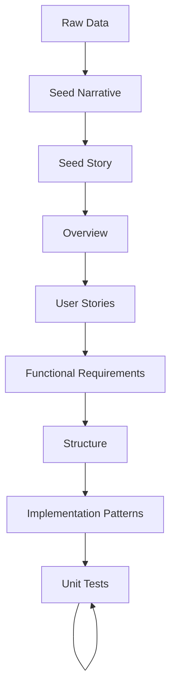

# Project Memory Core (PMC) - System Overview and Document Generation
**Version:** 1.0.0  
**Date:** February 20, 2025  
**Category:** Project Management System

## 1. What is Project Memory Core?

Project Memory Core (PMC) is a sophisticated documentation and project management system designed to maintain consistent, high-quality project documentation through AI-assisted generation. It serves as a foundational framework that enables:

1. **Structured Documentation**: A hierarchical system of interconnected documents that define and track project development
2. **AI-Assisted Generation**: Automated document generation with AI guidance while maintaining quality through example-based templating
3. **Project Memory Management**: Both short-term and long-term project context preservation
4. **Development Guidance**: Clear patterns and practices for project implementation

### Core Components

The PMC system consists of three main components:

1. **Document Generation System**
   - Templates for consistent document structure
   - Example-based generation for quality control
   - Configuration-driven process management
   - Progress tracking and caching

2. **Product Documentation**
   - Hierarchical document structure
   - Clear dependency relationships
   - Version-controlled artifacts
   - Standardized formats

3. **Project Management Tools**
   - Progress tracking
   - Task management
   - Implementation guidance
   - Quality assurance

## 2. Document Generation Process

### 2.1 Seed Story Generation

The seed story generation process uses the script `00-generate-seed-story.js` and follows these steps:

1. **Configuration Loading**
   - Reads `seed-story-config.json` for template paths and placeholders
   - Validates file paths and creates cache
   - Manages progress tracking

2. **Document Generation Sequence**
   ```
   Raw Data → Seed Narrative → Seed Story
   ```

3. **Key Files**
   - Template: `_templates/00-seed-narrative-template.md`
   - Prompt: `_prompt_engineering/product-seed-narrative-prompt-template_v1.md`
   - Example: `_examples/00-[project-abbreviation]-seed-narrative.md`
   - Output: `00-{project_abbreviation}-seed-narrative.md`

### 2.2 Product Specification Generation

The product specification generation uses `01-05-generate-product-specs.js` and generates the following documents in sequence:

1. **Overview** (`01-[project-abbreviation]-overview.md`)
   - High-level product description
   - Core value proposition
   - Target audience
   - Project goals

2. **User Stories** (`02-[project-abbreviation]-user-stories.md`)
   - Stakeholder narratives
   - Use cases
   - User journeys
   - Experience goals

3. **Functional Requirements** (`03-[project-abbreviation]-functional-requirements.md`)
   - Technical specifications
   - System requirements
   - Feature definitions
   - Acceptance criteria

4. **Structure** (`04-[project-abbreviation]-structure.md`)
   - System architecture
   - Component organization
   - Data flow
   - Integration points

5. **Implementation Patterns** (`05-[project-abbreviation]-implementation-patterns.md`)
   - Coding standards
   - Design patterns
   - Best practices
   - Technical guidelines

6. **Tasks** (`06-[project-abbreviation]-tasks.md`)
   - Work breakdown
   - Implementation steps
   - Dependencies
   - Progress tracking

## 3. Document Hierarchy and Purpose

### 3.1 Core Documents

1. **Seed Narrative** (`00-[project-abbreviation]-seed-narrative.md`)
   - Takes in unstructured data and returns a structured narrative of the project
   - Initial project vision
   - Stakeholder analysis
   - Pain points
   - User narratives
   - Core problems

2. **Seed Story** (`00-[project-abbreviation]-seed-story.md`)
   - Takes in the seed narrative and builds the core story of the project
   - Expanded project definition
   - Success criteria
   - Core capabilities
   - Technical context
   - Implementation scope

3. **Product Overview** (`01-[project-abbreviation]-overview.md`)
   - Takes in the seed story and builds the overview of the product, including the product summary, value proposition, user success goals, technical goals, and product dependencies
   - Product summary
   - Value proposition
   - Target audience
   - Project goals
   - Core features

4. **User Stories** (`02-[project-abbreviation]-user-stories.md`)
   - Detailed user narratives
   - Experience requirements
   - Interaction flows
   - Success scenarios

5. **Functional Requirements** (`03-[project-abbreviation]-functional-requirements.md`)
   - Technical specifications
   - System requirements
   - Feature definitions
   - Integration requirements

6. **Structure** (`04-[project-abbreviation]-structure.md`)
   - System architecture
   - Component organization
   - Data flow diagrams
   - Integration patterns

7. **Implementation Patterns** (`05-[project-abbreviation]-implementation-patterns.md`)
   - Development standards
   - Design patterns
   - Best practices
   - Quality guidelines

8. **Tasks** (`06-[project-abbreviation]-tasks.md`)
   - Work breakdown structure
   - Implementation sequence
   - Dependencies
   - Progress tracking

9. **Unit Testing** (`07b-task-[project-abbreviation]-testing-built.md`)
   - Inline testing instructions
   - Testing files and directories prepared
   - Testing sequence
   - Testing breakdown structure


### 3.2 Document Dependencies



## 4. Using PMC

### 4.1 Document Generation

1. **Generate Seed Narrative & Seed Story**
   ```bash
   cd pmc/product/_tools
   node 00-generate-seed-story.js
   ```

2. **Generate Product Specifications**
   ```bash
   cd pmc/product/_tools
   node 01-05-generate-product-specs.js "Project Name" project-abbreviation
   ```

### 4.2 Progress Tracking

The system maintains progress through:
- `.{project-abbreviation}-progress.json`: Tracks current generation step
- `.{project-abbreviation}-paths-cache.json`: Caches validated file paths

### 4.3 Best Practices

1. **Document Generation**
   - Review examples before generation
   - Validate generated content
   - Maintain consistent terminology
   - Follow the document hierarchy

2. **Project Management**
   - Update progress regularly
   - Validate dependencies
   - Maintain file organization
   - Follow naming conventions

3. **Quality Assurance**
   - Review generated content
   - Validate technical accuracy
   - Ensure consistency
   - Track changes
