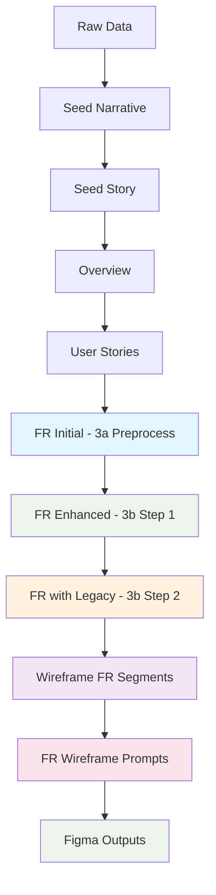

# Project Memory Core (PMC) - System Overview and Document Generation
**Version:** 3.0.0  
**Date:** January 21, 2025  
**Category:** Project Management System

## 1. What is Project Memory Core?

Project Memory Core (PMC) is a sophisticated documentation and project management system designed to maintain consistent, high-quality project documentation through AI-assisted generation. It serves as a foundational framework that enables:

1. **Structured Documentation**: A hierarchical system of interconnected documents that define and track project development
2. **AI-Assisted Generation**: Automated document generation with AI guidance while maintaining quality through example-based templating
3. **Project Memory Management**: Both short-term and long-term project context preservation
4. **Development Guidance**: Clear patterns and practices for project implementation

### Core Components

The PMC system consists of four main components:

1. **Document Generation System**
   - Templates for consistent document structure
   - Example-based generation for quality control
   - Configuration-driven process management
   - Progress tracking and caching

2. **Product Documentation**
   - Hierarchical document structure
   - Clear dependency relationships
   - Version-controlled artifacts
   - Standardized formats

3. **Project Management Tools**
   - Progress tracking
   - Task management
   - Implementation guidance
   - Quality assurance

4. **Advanced Wireframe Generation**
   - Functional requirements to wireframe mapping
   - FR-level wireframe prompt generation
   - Interactive prompt engineering tools
   - Automated mapping and cross-referencing

## 2. Document Generation Process

### 2.1 Step 0: Seed Story Generation

The seed story generation process uses the script `00-generate-seed-story.js` and follows these steps:

**Input Files:**
- `_seeds/seed-narrative-v1.md` (contains project name and abbreviation)
- `seed-story-config.json` (configuration file)
- `_templates/00-seed-narrative-template.md` (narrative template)
- `_prompt_engineering/product-seed-narrative-prompt-template_v1.md` (prompt template)
- `_examples/00-[project-abbreviation]-seed-narrative.md` (reference example)

**Process:**
1. **Configuration Loading**
   - Reads `seed-story-config.json` for template paths and placeholders
   - Validates file paths and creates cache
   - Manages progress tracking

2. **Document Generation Sequence**
   ```
   Raw Data → Seed Narrative → Seed Story
   ```

**Outputs:**
- `00-{project_abbreviation}-seed-narrative.md`
- `00-{project_abbreviation}-seed-story.md`

**Usage:**
```bash
cd pmc/product/_tools
node 00-generate-seed-story.js
```

### 2.2 Steps 1-2: Product Specification Generation

The product specification generation uses `01-02-generate-product-specs.js` and generates the first two core documents:

**Input Files:**
- `00-{project-abbreviation}-seed-story.md` (from step 0)
- `config/prompts-config.json` (configuration file)
- Template files specified in configuration:
  - Overview template (typically `_templates/01-overview-template.md`)
  - User stories template (typically `_templates/02-user-stories-template.md`)
- Example files (specified in configuration):
  - Overview example (typically `_examples/01-{project-abbreviation}-overview.md`)
  - User stories example (typically `_examples/02-{project-abbreviation}-user-stories.md`)

**Process:**
#### Step 1: Overview Generation

1. **Overview** (`01-[project-abbreviation]-overview.md`)
   - High-level product description
   - Core value proposition
   - Target audience and pain points
   - Project goals and success criteria
   - Core features and functional scope
   - Product architecture overview
   - Technology stack and dependencies

#### Step 2: User Stories Generation

2. **User Stories** (`02-[project-abbreviation]-user-stories.md`)
   - Categorized user stories by impact area
   - Stakeholder narratives and personas
   - Use cases and user journeys
   - Experience goals and acceptance criteria
   - Priority levels and FR mapping placeholders

**Outputs:**
- `01-{project-abbreviation}-overview.md`
- `02-{project-abbreviation}-user-stories.md`
- Prompt files in `_run-prompts/` directory

**Usage:**
```bash
cd pmc/product/_tools
node 01-02-generate-product-specs.js "Project Name" project-abbreviation
```

### 2.3 Step 3: Enhanced Functional Requirements Generation

The functional requirements generation uses `03-generate-functional-requirements.js` with a sophisticated two-step process:

**Input Files:**
- `01-{project-abbreviation}-overview.md` (from step 1)
- `02-{project-abbreviation}-user-stories.md` (from step 2)
- `03-{project-abbreviation}-functional-requirements.md` (initial or existing)
- Template files:
  - `_prompt_engineering/3a-preprocess-functional-requirements-prompt_v1.md` (preprocessing)
  - `_prompt_engineering/3b-functional-requirements-prompt_v1.md` (enhancement)
  - `_prompt_engineering/3b-#1-functional-requirements-prompt_v1.md` (first enhancement step)
  - `_prompt_engineering/3b-#2-functional-requirements-prompt_v1.md` (second enhancement step)
- Example file:
  - `_examples/03-{project-abbreviation}-functional-requirements.md`
- Optional: Codebase for legacy integration

**Process:**
#### Step 3a: Preprocessing

1. **Initial Requirements Generation**
   - Converts user stories to functional requirements
   - Creates basic FR structure with placeholders
   - Maintains traceability to user stories
   - Generates initial acceptance criteria

#### Step 3b: Enhancement Process

1. **Requirements Enhancement** (3b-#1 prompt)
   - Expands and improves functional requirements
   - Adds detailed technical specifications
   - Enhances acceptance criteria
   - Improves clarity and completeness

2. **Legacy Code Integration** (3b-#2 prompt)
   - Adds references to existing codebase
   - Maps requirements to current implementation
   - Identifies integration points
   - Documents migration strategies

**Key Features:**
- **Two-step process**: Preprocess → Enhance
- **Quality control**: Example-based generation with validation
- **Progress tracking**: Saves state between steps
- **Path caching**: Remembers file locations for efficiency
- **Output management**: Saves prompts to `_prompt_engineering/output-prompts/`

**Outputs:**
- Enhanced `03-{project-abbreviation}-functional-requirements.md`
- Prompt files in `_prompt_engineering/output-prompts/`

**Usage:**
```bash
cd pmc/product/_tools
node 03-generate-functional-requirements.js "Project Name" project-abbreviation
```

### 2.4 Step 4: Wireframe Generation System (v4)

Uses `04-generate-FR-wireframe-segments_v4.js` for advanced wireframe prompt generation:

**Input Files:**
- `03-{project-abbreviation}-functional-requirements.md` (from step 3)
- `_prompt_engineering/04-FR-wireframes-prompt_v4.md` (v4 template)

**Process:**
1. **FR-Level Wireframe Generation**
   - Extracts individual FR identifiers from each section
   - Generates wireframe prompts per FR (not per section)
   - Calculates precise line numbers for prompt targeting
   - Creates comprehensive generator prompt files

2. **Advanced Features**
   - **Multi-FR Processing**: Handles multiple FRs per section
   - **Line Number Precision**: Calculates exact starting lines for each FR block
   - **Template-Based Generation**: Uses v4 template with full placeholder replacement
   - **Automated Output Paths**: Enforces consistent file naming and organization

3. **Template Placeholder System**
   - `[FR_NUMBER_PLACEHOLDER]`: Specific FR identifier (e.g., FR1.1.0)
   - `[STAGE_NAME_PLACEHOLDER]`: Section stage name
   - `[MINIMUM_PAGE_COUNT_PLACEHOLDER]`: Required wireframe pages
   - `[SECTION_ID_PLACEHOLDER]`: Section identifier (E01, E02, etc.)
   - `[FR_LOCATE_FILE_PATH_PLACEHOLDER]`: Path to prompt file
   - `[FR_LOCATE_LINE_PLACEHOLDER]`: Starting line number for FR
   - `[OUTPUT_FILE_PATH_PLACEHOLDER]`: Figma output destination

**Output Structure:**
```
product/_mapping/fr-maps/
├── 04-{project-abbrev}-FR-wireframes-E01.md    # Section files
├── 04-{project-abbrev}-FR-wireframes-E02.md
├── prompts/
│   ├── 04-FR-wireframes-prompt-E01.md          # All FRs for section E01
│   └── 04-FR-wireframes-prompt-E02.md          # All FRs for section E02
├── 04-bmo-FR-wireframes-output-E01.md          # Figma outputs (created by agent)
├── 04-bmo-FR-wireframes-output-E02.md
└── 04-FR-wireframes-index.md                   # Master index
```

**Outputs:**
- Section-based FR wireframe files
- Combined generator prompt files per section
- Master index file
- Output placeholder files for Figma results

**Usage:**
```bash
cd pmc/product/_tools
node 04-generate-FR-wireframe-segments_v4.js "Project Name" project-abbreviation
```

## 3. Document Hierarchy and Purpose

### 3.1 Core Documents

1. **Seed Narrative** (`00-[project-abbreviation]-seed-narrative.md`)
   - Takes in unstructured data and returns a structured narrative of the project
   - Initial project vision and stakeholder analysis
   - Pain points and user narratives
   - Core problems and opportunity definition

2. **Seed Story** (`00-[project-abbreviation]-seed-story.md`)
   - Takes in the seed narrative and builds the core story of the project
   - Expanded project definition and success criteria
   - Core capabilities and technical context
   - Implementation scope and constraints

3. **Product Overview** (`01-[project-abbreviation]-overview.md`)
   - Takes in the seed story and builds comprehensive product documentation
   - Product summary and value proposition
   - Target audience and market analysis
   - Project goals and core features
   - Technical architecture and dependencies

4. **User Stories** (`02-[project-abbreviation]-user-stories.md`)
   - Detailed user narratives categorized by impact
   - Experience requirements and interaction flows
   - Success scenarios and acceptance criteria
   - Priority levels and FR mapping preparation

5. **Functional Requirements** (`03-[project-abbreviation]-functional-requirements.md`)
   - Technical specifications derived from user stories
   - System requirements and feature definitions
   - Integration requirements and dependencies
   - Enhanced through two-step generation process

6. **Wireframe Specifications** (`04-*-FR-wireframes-E[XX].md`)
   - FR-level wireframe requirements organized by section
   - Section-based requirement organization
   - Figma-ready prompt generation with precise targeting
   - Automated output file management

### 3.2 Document Dependencies



## 4. Tool Reference Guide

### 4.1 Generation Scripts

| Script | Purpose | Input Files | Outputs |
|--------|---------|-------------|---------|
| `00-generate-seed-story.js` | Creates seed narrative and story | `_seeds/seed-narrative-v1.md`, templates, examples | Narrative + Story docs |
| `01-02-generate-product-specs.js` | Combined overview + user stories | Seed story, config, templates, examples | Overview + User Stories |
| `03-generate-functional-requirements.js` | Enhanced FR generation | Overview, User Stories, FR templates, examples | Enhanced FR + prompts |
| `04-generate-FR-wireframe-segments_v4.js` | Wireframe generation | Functional Requirements, v4 template | FR wireframe prompts + sections |

### 4.2 Configuration and Templates

#### Key Configuration Files
- `seed-story-config.json`: Seed generation configuration
- `config/prompts-config.json`: Product spec generation configuration

#### Template Directories
- `_templates/`: Base document templates
- `_examples/`: Reference examples for quality control
- `_prompt_engineering/`: AI prompt templates and outputs
- `_seeds/`: Initial project data

#### Cache and Progress
- `cache/`: Path caching for efficiency
- `progress/`: Generation progress tracking
- `_run-prompts/`: Generated prompt outputs
- `_mapping/fr-maps/`: Wireframe generation outputs

### 4.3 Advanced Features

#### Path Management
- **Automatic path resolution**: Handles relative and absolute paths
- **Path caching**: Remembers validated paths across sessions
- **Cross-platform compatibility**: Works on Windows and Unix systems

#### Quality Control
- **Example-based generation**: Uses reference examples for consistency
- **Template validation**: Ensures all placeholders are replaced
- **Progress checkpointing**: Allows resumption of interrupted processes

#### Integration Features
- **Codebase review integration**: Optional legacy code analysis
- **Conditional sections**: Dynamic content based on user choices
- **Cross-document referencing**: Maintains traceability between documents

## 5. Best Practices

### 5.1 Document Generation Workflow

1. **Preparation Phase**
   - Ensure all templates and examples are up to date
   - Clear any stale cache files if needed
   - Prepare raw project data in `_seeds/seed-narrative-v1.md`

2. **Generation Sequence**
   ```bash
   # Step 0: Foundation
   node 00-generate-seed-story.js
   
   # Steps 1-2: Core specifications
   node 01-02-generate-product-specs.js "Project Name" abbrev
   
   # Step 3: Enhanced requirements
   node 03-generate-functional-requirements.js "Project Name" abbrev
   
   # Step 4: Wireframe generation
   node 04-generate-FR-wireframe-segments_v4.js "Project Name" abbrev
   ```

3. **Validation Phase**
   - Review generated documents for completeness
   - Validate cross-references and mappings
   - Test generated prompts for clarity

### 5.2 Quality Assurance

1. **Document Review**
   - Verify all placeholders are replaced
   - Check for consistent terminology
   - Ensure logical flow between documents

2. **Technical Validation**
   - Confirm technical accuracy
   - Validate architectural decisions
   - Review integration requirements

3. **Process Validation**
   - Test prompt effectiveness
   - Verify wireframe generation quality
   - Confirm output file organization

### 5.3 Maintenance and Updates

1. **Template Management**
   - Keep templates synchronized with latest practices
   - Update examples to reflect current standards
   - Version control template changes

2. **Tool Updates**
   - Monitor script performance and reliability
   - Update path handling for new requirements
   - Enhance error handling and user experience

3. **Documentation Maintenance**
   - Keep this overview updated with system changes
   - Document new features and capabilities
   - Maintain troubleshooting guides

## 6. Input File Requirements

### 6.1 Required Input Files by Step

**Step 0:**
- `pmc/product/_seeds/seed-narrative-v1.md` (must contain project name and abbreviation)

**Steps 1-2:**
- `00-{project-abbreviation}-seed-story.md` (output from step 0)
- Configuration and template files as specified in `config/prompts-config.json`

**Step 3:**
- `01-{project-abbreviation}-overview.md` (output from step 1)
- `02-{project-abbreviation}-user-stories.md` (output from step 2)
- `03-{project-abbreviation}-functional-requirements.md` (initial or existing)
- Preprocessing and enhancement template files

**Step 4:**
- `03-{project-abbreviation}-functional-requirements.md` (enhanced output from step 3)
- `_prompt_engineering/04-FR-wireframes-prompt_v4.md` (v4 template)

### 6.2 File Format Requirements

All input markdown files should follow these standards:
- UTF-8 encoding
- Consistent heading hierarchy
- Proper section numbering for FR files
- Clear FR identifiers (e.g., FR1.1.0, FR1.2.0)

## 7. Troubleshooting Guide

### Common Issues

1. **Path Resolution Errors**
   - Clear cache files in relevant directories
   - Verify file paths exist before generation
   - Check for proper project structure

2. **Template Not Found**
   - Ensure template files exist in expected locations
   - Verify template names match configuration
   - Check for proper file permissions

3. **Generation Interruption**
   - Resume from progress files
   - Clear problematic cache entries
   - Restart individual steps as needed

### Error Recovery

1. **Cache Management**
   ```bash
   # Clear all cache files
   rm -rf pmc/product/_tools/cache/*
   
   # Clear specific project cache
   rm pmc/product/_tools/cache/*{project-abbrev}*
   ```

2. **Progress Reset**
   ```bash
   # Reset progress for specific project
   rm pmc/.{project-abbrev}-progress.json
   rm pmc/.{project-abbrev}-paths-cache.json
   ```

### Performance Optimization

1. **Use cached paths when available**
2. **Run steps in sequence for dependency consistency**
3. **Monitor output file sizes for reasonable limits**
4. **Regular cleanup of temporary files**

## 8. Future Enhancements

### Planned Features
- **Automated testing integration**: Link with testing frameworks
- **Code generation**: Automatic scaffolding from requirements
- **CI/CD integration**: Automated documentation updates
- **Advanced analytics**: Generation quality metrics

### Extension Points
- **Custom template systems**: Support for domain-specific templates
- **Plugin architecture**: Extensible tool system
- **API integration**: External tool connectivity
- **Collaborative features**: Multi-user document generation

---

**For questions and support**, refer to the project documentation or contact the development team.
