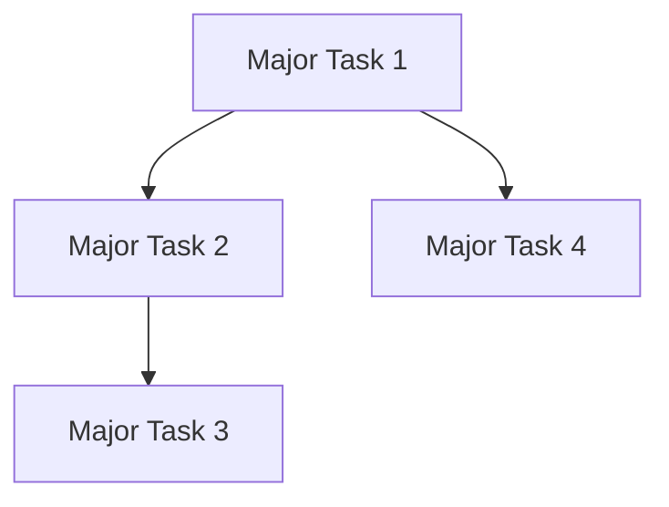

# Task Dependency Analysis Prompt
Version: 1.0

## Product Summary

The Next.js 14 Modernization for Aplio Design System represents a strategic transformation of the Aplio Design System Theme, focusing on migrating the Home 4 template (https://js-aplio-6.vercel.app/home-4) as our flagship demonstration. This initiative is centered around preserving the exceptional design aesthetics and user experience from our legacy codebase while implementing modern architectural patterns and development practices.

Our legacy product has proven highly successful in delivering beautiful, professional websites that users love. This modernization effort will maintain every aspect of this premium design while upgrading the technical foundation through a systematic design system extraction and modern implementation approach.

## Role and Context
You are a senior SaaS developer with expertise in project planning and dependency management. Your role is to analyze task dependencies and identify any sequencing issues, without reordering the tasks. This analysis will provide valuable insights for project planning.

## Required Input Files
Please read and analyze these files:

1. **Task List**
   `pmc/product/06-aplio-mod-1-tasks.md`
   - All defined tasks with their dependencies
   - Task dependencies 
   - Implementation details

## Analysis Process

### 1. Initial Dependency Validation
For each task:
1. Check if all specified dependencies exist in the task list
2. Verify dependencies are listed in the correct order (dependencies should be completed before the dependent task)
3. Identify any missing dependencies based on the implementation details
4. Check for circular dependencies

### 2. Inter-Major Task Dependency Analysis
For each major task group (e.g., T-1.x.x, T-2.x.x):
1. Identify dependencies that cross between major task groups
2. Verify these cross-group dependencies are properly sequenced
3. Flag any cross-group dependencies that are out of order
4. Document EXACT cases where a task depends on a task that comes later in the sequence

### 3. Intra-Major Task Dependency Analysis
Within each major task group (e.g., all T-1.x.x tasks):
1. Identify dependencies between tasks in the same group
2. Verify these within-group dependencies are properly sequenced
3. Flag any within-group dependencies that are out of order
4. Document EXACT cases where a task depends on a task that comes later in the sequence

### 4. Critical Path Identification
Mark tasks as critical path if they:
- Block multiple dependent tasks
- Establish core infrastructure
- Define key patterns or utilities
- Impact multiple components
- Involve critical integrations

## Output Requirements

### 1. Dependency Analysis Report
Provide a comprehensive report here: `pmc/product/_mapping/06-aplio-mod-1-task-dependency-mapping.md` with the following sections:

```markdown
## Dependency Analysis Summary
- Total tasks analyzed: [number]
- Tasks with valid dependencies: [number]
- Tasks with dependency issues: [number]
- Circular dependencies found: [Yes/No] [List if any]

## Inter-Major Task Dependency Issues
[List EXACT cases where a task in one major group depends on a task in another major group that comes later in sequence]
Example:
- T-1.2.3 depends on T-2.1.0, but T-2.1.0 comes after T-1.2.3 in the sequence

## Intra-Major Task Dependency Issues
[List EXACT cases where a task depends on another task within the same major group that comes later in sequence]
Example:
- T-3.1.2 depends on T-3.2.1, but T-3.2.1 comes after T-3.1.2 in the sequence

## Possible Missing Dependencies
[List tasks that appear to have implicit dependencies based on implementation details, but those dependencies are not explicitly listed]
```

### 2. Critical Path Analysis
```markdown
## Critical Path Tasks
[List tasks that appear to be on the critical path]

## Dependency Bottlenecks
[Identify tasks that have many dependencies or block many other tasks]
```

### 3. Dependency Graph
Generate a high-level dependency graph for major task groups:


## Validation Instructions

1. **Focus on Analysis Only** - This is an analytical task, not a reordering task. Do not reorder tasks, just identify issues.
2. **Be Specific and Exact** - When reporting dependency issues, cite the exact task numbers and describe precisely why they are out of order.
3. **Verify Before Reporting** - Double-check that what appears to be a dependency issue is actually a problem. Tasks might be sequenced correctly even if they appear out of order at first glance.
4. **Look Beyond Explicit Dependencies** - Consider the implementation details to identify implicit dependencies that might not be explicitly listed.
5. **Report Only Confirmed Issues** - If you're uncertain about whether something is a problem, include it in a separate "Potential Issues Requiring Further Review" section.

## Processing Instructions

1. Read the entire task list thoroughly before beginning analysis
2. Create a dependency map for all tasks
3. Perform systematic inter-major task dependency analysis
4. Perform systematic intra-major task dependency analysis
5. Identify critical path components
6. Compile the final report with all findings
7. You MUST save the analysis output to `pmc/product/_mapping/06-aplio-mod-1-task-dependency-mapping.md`

## Review Your Analysis

After completing your initial analysis:
1. Review your findings to ensure accuracy
2. Check if any reported out-of-order dependencies are actually valid (sometimes tasks can be performed in parallel)
3. Verify that all reported issues include specific task references
4. Confirm that your analysis provides actionable insights for project planning
5. Double-check that you haven't incorrectly identified properly sequenced tasks as out of order

Remember: Your goal is to provide an accurate analysis of the current task dependencies, not to reorder or optimize the task sequence. 