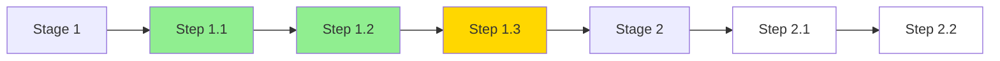
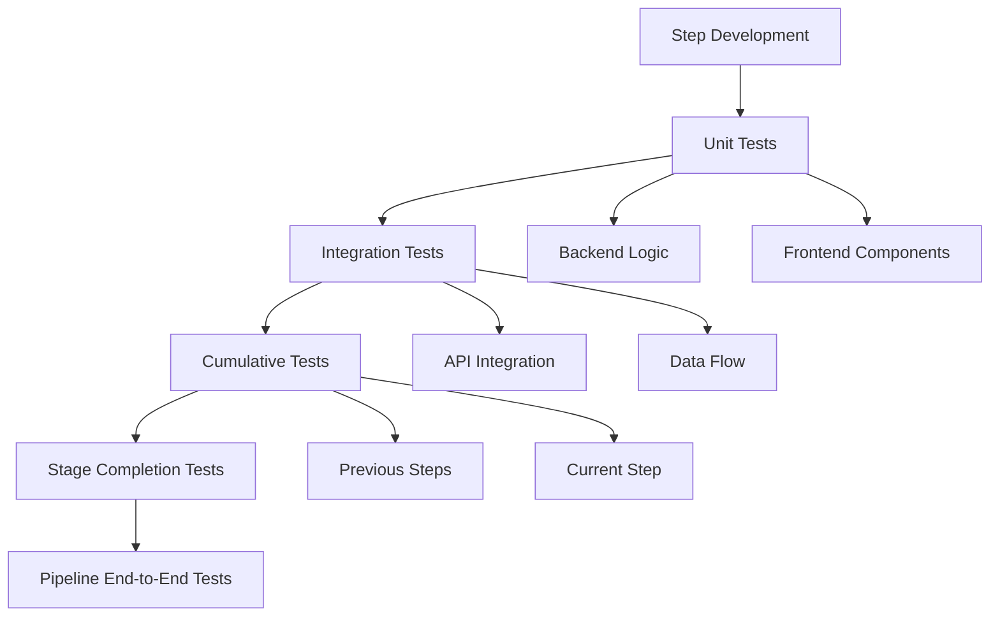

# Integrated Pipeline Development Methodology (IPDM)
## A Stage-Sequential, Step-Atomic Approach for Bright Run LoRA Training Platform

**Version:** 2.0.0  
**Date:** 2025-01-25  
**Product:** Bright Run LoRA Fine-Tuning Training Data Platform  
**Abbreviation:** BMO-IPDM

---

## Executive Summary

The Integrated Pipeline Development Methodology (IPDM) addresses the fundamental disconnect between backend functionality and user experience by developing features as **complete vertical slices** through the application stack. Each development unit represents a single, testable step in the pipeline that delivers immediate user value.

After analyzing both UI-first and functionality-first approaches, the core problem is **disconnection between backend engine development and human usability**. The solution is a **Stage-Sequential, Step-Atomic Development Methodology** that builds the application "live" by developing each pipeline step with both backend functionality and frontend interface simultaneously, testing in production locations.

### Core Principles
1. **Vertical Integration**: Each step includes backend + frontend + testing as an atomic unit
2. **Sequential Pipeline Development**: Build stages in order, steps within stages in order
3. **Live Development Environment**: Build components in their production locations, not test scaffolds
4. **Cumulative Testing**: Each new step validates all previous functionality
5. **User-Centric Functionality**: Every backend feature has a corresponding user interaction
6. **Production Structure**: Build modules, components, and pages where they belong in production architecture

---

## Problem Analysis

### Current Development Gaps

#### Backend-First Problems
- **Invisibility**: Engine features have no human touchpoint
- **Assumption Drift**: Technical solutions diverge from user needs
- **Integration Debt**: Retrofitting UI to existing engines creates friction
- **Testing Blindness**: Cannot validate user experience until late in development
- Creates backend "engines" that sound good on paper but lack human usability
- No clear path from technical functionality to user experience

#### UI-First Problems
- **Functionality Mismatch**: Frontend assumes backend capabilities that don't exist
- **Rework Cycles**: UI must be rebuilt when backend reality differs from assumptions
- **Mock Data Trap**: Testing with mocks hides integration issues
- **Feature Creep**: UI suggests features that backend cannot efficiently deliver
- Builds frontend mapped to "what should be" rather than actual functionality
- Creates beautiful interfaces that don't connect to real backend needs

### Root Cause
**The fundamental issue is temporal separation** - building backend and frontend at different times creates:
- Context loss between development phases
- Assumptions that drift from reality
- Integration challenges that compound over time
- Quality issues from retrofitting rather than co-designing
- Backend development divorced from actual human interaction patterns
- Frontend development based on assumptions rather than functional reality
- Testing happens in isolation rather than integrated environments

---

## IPDM Solution Architecture

### Development Unit: The Pipeline Step

Each **Pipeline Step** is the atomic unit of development, containing:

```yaml
Pipeline Step:
  Backend:
    - Data Models (if needed)
    - API Endpoints (specific to step)
    - Business Logic (step-specific only)
    - Database Operations (step-specific)
    - File/Storage Operations (if needed)
  
  Frontend:
    - UI Components (production location)
    - State Management (for this step)
    - API Integration (connects to backend)
    - User Interactions (complete flow)
    - Visual Feedback (loading, errors, success)
  
  Testing:
    - Backend Unit Tests (in place)
    - Frontend Component Tests (in place)
    - Integration Tests (frontend + backend)
    - User Flow Tests (cumulative with previous steps)
    - Data Validation Tests
```

### Development Flow

```
Pipeline Stage 1 → Step 1 → Backend + Frontend + Test → Step 2 → Backend + Frontend + Test → ...
                ↓
Pipeline Stage 2 → Step 1 → Backend + Frontend + Test → Step 2 → Backend + Frontend + Test → ...
                ↓
Pipeline Stage 3 → ...
```

### Development Sequence



Legend:
- 🟢 Green: Completed and tested
- 🟡 Yellow: In development
- ⚪ White: Not started

---

## BMO Pipeline Analysis

Based on the functional requirements, the BMO platform has a clear 6-stage pipeline:

### Stage 1: Knowledge Ingestion & Document Processing
**Steps:**
1.1: File Upload Interface & Processing
1.2: Document Format Detection & Text Input Validation
1.3: Content Extraction & Preview
1.4: Metadata Preservation
1.5: Error Handling & Validation

### Stage 2: Content Analysis & Understanding
**Steps:**
2.1: Topic Extraction Display
2.2: Entity Recognition Interface
2.3: Relationship Mapping & Knowledge Structure Visualization
2.4: Context Preservation
2.5: Quality Assessment

### Stage 3: Knowledge Structure & Training Pair Generation
**Steps:**
3.1: Concept Clustering & Q&A Pair Creation Interface
3.2: Hierarchical Organization & Conversation Generation Controls
3.3: Knowledge Graph Construction & Training Pair Preview & Edit
3.4: Dependency Tracking
3.5: Structure Validation

### Stage 4: Semantic Variation & Enhancement
**Steps:**
4.1: Variation Parameters Configuration
4.2: Variation Generation & Display (100+ per pair)
4.3: Style Adaptation & Variation Quality Assessment
4.4: Difficulty Adjustment
4.5: Diversity Measurement & Quality Filtering

### Stage 5: Quality Assessment
**Steps:**
5.1: Automated Quality Metrics Display
5.2: Manual Review Interface
5.3: Quality Improvement Controls
5.4: Quality Scoring
5.5: Validation Processes

### Stage 6: Export & Integration
**Steps:**
6.1: Format Selection & Configuration
6.2: Export Generation & Download
6.3: Training Platform Integration
6.4: Dataset Generation
6.5: Integration Testing

---

## Implementation Methodology

### For Each Pipeline Step:

#### A. Backend Development First (2-3 hours)
- Build ONLY the functionality needed for this specific step
- Include APIs, database functions, connections for this step
- Use mock data in actual production database locations
- Create data file mockups only where they would live in production
- Build services, utilities, and data models in production structure

```typescript
// Location: src/app/api/pipeline/stage1/upload/route.ts
export async function POST(request: Request) {
  // 1. File validation logic
  // 2. Storage operations
  // 3. Database record creation
  // 4. Response with processing status
}

// Location: src/lib/services/pipeline/stage1/file-processor.ts
export class FileProcessor {
  // Actual file processing logic
  // PDF, DOCX, TXT parsing
  // Content extraction
}

// Location: prisma/schema.prisma (if needed)
model UploadedFile {
  id        String   @id
  filename  String
  content   String
  status    Status
  createdAt DateTime
}
```

#### B. Frontend Development Second (2-3 hours)
- Build the interface that maps directly to the backend step
- Create components in production locations (`src/components/[category]/`)
- Build pages in production locations (`src/app/[path]/page.tsx`)
- Connect frontend directly to backend APIs
- Implement real-time feedback and status indicators

```typescript
// Location: src/app/(pipeline)/pipeline/[projectId]/stage1/upload/page.tsx
export default function UploadPage() {
  // 1. File upload component
  // 2. Drag-and-drop interface
  // 3. Progress indicators
  // 4. Error handling UI
  // 5. Success feedback
}

// Location: src/components/pipeline/stage1/file-uploader.tsx
export function FileUploader() {
  // Reusable upload component
  // Connected to backend API
  // Real file processing
}
```

#### C. Integration Testing Third (1-2 hours)
- Test the ACTUAL component in its production location
- No test scaffolds or separate test directories
- Test both backend functionality and frontend interface
- Validate data flow from frontend through backend
- Ensure error handling works end-to-end

```typescript
// Test in browser at: /pipeline/[projectId]/stage1/upload
// 1. Upload real file
// 2. Verify processing
// 3. Check database records
// 4. Validate UI feedback
// 5. Test error scenarios
```

#### D. Cumulative Validation Fourth (30 minutes)
- Test all previously built components still work
- Validate the entire pipeline up to current step
- Ensure new step integrates seamlessly with previous steps
- Test user workflow from beginning through current step

```typescript
// After Step 1.2 is complete:
// 1. Test Step 1.1 still works
// 2. Test Step 1.1 -> Step 1.2 flow
// 3. Verify data persistence
// 4. Check navigation between steps
```

---

## Production Structure Requirements

```
src/
├── app/                          # Next.js app router pages
│   ├── pipeline/                 # Main pipeline interface
│   │   ├── stage-1/             # Document processing
│   │   ├── stage-2/             # Content analysis
│   │   ├── stage-3/             # Knowledge structure
│   │   ├── stage-4/             # Training pair generation
│   │   ├── stage-5/             # Semantic variation
│   │   └── stage-6/             # Export & integration
│   └── dashboard/               # Project management
├── components/                   # Reusable UI components
│   ├── pipeline/                # Pipeline-specific components
│   ├── shared/                  # Shared UI components
│   └── forms/                   # Form components
├── lib/                         # Core business logic
│   ├── pipeline/                # Pipeline orchestration
│   ├── analysis/                # Content analysis
│   ├── generation/              # Training pair generation
│   └── export/                  # Export functionality
├── api/                         # API routes
│   ├── pipeline/                # Pipeline endpoints
│   ├── analysis/                # Analysis endpoints
│   └── export/                  # Export endpoints
└── types/                       # TypeScript definitions
```

---

## Task File Structure

### Modular Task Files by Stage

```
pmc/product/tasks/
├── 07-bmo-tasks-stage1.md    # Knowledge Ingestion Tasks
├── 08-bmo-tasks-stage2.md    # Content Analysis Tasks
├── 09-bmo-tasks-stage3.md    # Training Pair Generation Tasks
├── 10-bmo-tasks-stage4.md    # Semantic Variation Tasks
├── 11-bmo-tasks-stage5.md    # Quality Assessment Tasks
├── 12-bmo-tasks-stage6.md    # Export & Deployment Tasks
└── 13-bmo-tasks-integration.md # Cross-stage Integration Tasks
```

### Task Template Structure

```markdown
# Stage [X]: [Stage Name] - Integrated Development Tasks

## Step [X.Y]: [Step Name]

### Task [X.Y]-BE: Backend Implementation
**Duration:** 2-3 hours
**Location:** src/app/api/pipeline/stage[X]/[endpoint]/
**Dependencies:** [Previous steps if any]

**Deliverables:**
- [ ] API endpoint at `/api/pipeline/stage[X]/[endpoint]`
- [ ] Data models in `prisma/schema.prisma` (if needed)
- [ ] Service class in `src/lib/services/pipeline/stage[X]/`
- [ ] Mock data seeded in database (if applicable)

**Backend Requirements:**
- **API Endpoints:** [specific endpoints needed]
- **Database Models:** [data structures for this step]
- **Services:** [business logic services]
- **Data Flow:** [input → processing → output]

**Implementation:**
1. Create API route handler
2. Implement business logic
3. Add database operations
4. Create service classes
5. Add error handling

**Validation:**
- [ ] API responds correctly to valid requests
- [ ] Error cases handled gracefully
- [ ] Data persisted correctly
- [ ] Performance within requirements

### Task [X.Y]-FE: Frontend Implementation
**Duration:** 2-3 hours
**Location:** src/app/(pipeline)/pipeline/[projectId]/stage[X]/
**Dependencies:** Task [X.Y]-BE

**Deliverables:**
- [ ] Page component at production location
- [ ] Reusable components in `src/components/pipeline/stage[X]/`
- [ ] State management connected to API
- [ ] Loading, error, and success states
- [ ] Responsive design implementation

**Frontend Requirements:**
- **Page Location:** `src/app/[specific-path]/page.tsx`
- **Components:** [specific components with locations]
- **User Interface:** [detailed UI requirements]
- **User Interactions:** [specific user actions]

**Implementation:**
1. Create page structure
2. Build UI components
3. Connect to backend API
4. Implement state management
5. Add user feedback mechanisms

**Validation:**
- [ ] UI renders correctly
- [ ] API integration works
- [ ] User interactions smooth
- [ ] Error states display properly
- [ ] Mobile responsive

### Task [X.Y]-TEST: Integration & Cumulative Testing
**Duration:** 1-2 hours
**Location:** Live application
**Dependencies:** Task [X.Y]-FE

**Integration Points:**
- **Backend APIs:** [how frontend connects to backend]
- **Data Validation:** [validation requirements]
- **Error Handling:** [error scenarios and handling]
- **Status Feedback:** [progress and status indicators]

**Test Scenarios:**
1. **Isolated Step Testing:**
   - [ ] Complete user flow for this step
   - [ ] All edge cases handled
   - [ ] Performance acceptable

2. **Cumulative Testing:**
   - [ ] Previous steps still function
   - [ ] Data flows between steps
   - [ ] Navigation works correctly
   - [ ] State preserved appropriately

**Testing Criteria:**
- [ ] Backend functionality works independently
- [ ] Frontend interface connects to backend
- [ ] User can complete step workflow
- [ ] Error handling provides clear guidance
- [ ] Integration with previous steps works
- [ ] Cumulative pipeline test passes

**Success Criteria:**
- [ ] Step works in isolation
- [ ] Step integrates with previous steps
- [ ] No regression in existing functionality
- [ ] User can complete full flow to this point

**Definition of Done:**
- [ ] Backend APIs respond correctly
- [ ] Frontend interface is functional
- [ ] Integration testing passes
- [ ] User can complete step in production location
- [ ] All previous steps still work
- [ ] Code is in production structure locations
```

---

## Quality Assurance Framework

### Live Testing Requirements
1. **No Test Scaffolds:** All testing happens in production component locations
2. **Real Data Flow:** Use actual database and API connections
3. **User Journey Testing:** Test complete user workflows, not isolated functions
4. **Progressive Validation:** Each new step must not break previous functionality
5. **Production Readiness:** Every component built should be production-ready

### Component Integration Standards
1. **Modular Architecture:** Components must be reusable and well-structured
2. **Clear Interfaces:** APIs and component props must be well-defined
3. **Error Boundaries:** Proper error handling at component and API levels
4. **Performance Standards:** Components must meet performance requirements
5. **Accessibility Compliance:** All UI components must be accessible

### Continuous Quality Metrics

#### Code Quality
- **Modularity**: Components reusable across steps
- **Type Safety**: Full TypeScript coverage
- **Documentation**: Inline comments and API docs
- **Testing**: Minimum 80% code coverage

#### User Experience
- **Response Time**: <200ms for user interactions
- **Feedback**: Clear loading, error, success states
- **Accessibility**: WCAG 2.1 AA compliance
- **Mobile**: Responsive design for all components

#### Integration Quality
- **API Contracts**: Validated with TypeScript types
- **Data Flow**: Consistent data structures throughout pipeline
- **Error Handling**: Graceful degradation at each step
- **State Management**: Predictable state transitions

### Testing Strategy



---

## Implementation Roadmap

### Phase 1: Foundation Setup
1. Create production directory structure
2. Set up database schema for Stage 1
3. Establish API routing patterns
4. Create base component library

### Phase 2: Stage-by-Stage Development
For each stage (1-6):
1. Create stage-specific task file
2. Implement each step using the methodology above
3. Validate cumulative functionality
4. Document lessons learned and adjustments

### Week 1-2: Stage 1 (Knowledge Ingestion)
```
Day 1-2: Step 1.1 - File Upload
  - Morning: Backend file processing
  - Afternoon: Frontend upload interface
  - Evening: Integration testing

Day 3-4: Step 1.2 - Text Input
  - Morning: Backend text validation
  - Afternoon: Frontend text editor
  - Evening: Cumulative testing (1.1 + 1.2)

Day 5: Step 1.3 - Content Preview
  - Morning: Backend preview generation
  - Afternoon: Frontend preview display
  - Evening: Full Stage 1 testing
```

### Week 3-4: Stage 2 (Content Analysis)
```
Day 6-7: Step 2.1 - Topic Extraction
  - Backend: NLP processing setup
  - Frontend: Topic display interface
  - Testing: Analysis accuracy validation

Day 8-9: Step 2.2 - Entity Recognition
  - Backend: Entity extraction service
  - Frontend: Entity visualization
  - Testing: Cumulative with topic extraction

Day 10: Step 2.3 - Knowledge Structure
  - Backend: Graph generation
  - Frontend: Interactive visualization
  - Testing: Complete Stage 2 flow
```

### Phase 3: Integration & Optimization
1. End-to-end pipeline testing
2. Performance optimization
3. User experience refinement
4. Production deployment preparation

### Subsequent Stages
Follow same pattern for Stages 3-6, with each stage building on previous functionality.

---

## Benefits of IPDM Approach

### Immediate Value Delivery
- **User-Visible Progress**: Each step produces working functionality
- **Early Feedback**: Issues discovered immediately, not after integration
- **Incremental Validation**: Assumptions tested continuously

### Reduced Integration Risk
- **No Big Bang Integration**: Components integrated as built
- **Continuous Compatibility**: Frontend and backend evolve together
- **Early Problem Detection**: Integration issues found in hours, not weeks

### Improved Quality
- **Contextual Development**: Developers see full picture while building
- **Real-World Testing**: No scaffold/mock discrepancies
- **Cumulative Validation**: Ensures system integrity maintained

### Developer Efficiency
- **Clear Scope**: Each task has defined boundaries
- **Reduced Context Switching**: Complete feature before moving on
- **Faster Debugging**: Issues isolated to current step

### Development Efficiency
- Reduced rework due to backend/frontend misalignment
- Faster integration testing cycles
- Earlier detection of usability issues
- More predictable development timelines

### Product Quality
- Higher user satisfaction with actual workflows
- Fewer post-development UI/UX changes
- More robust error handling and edge cases
- Better performance due to integrated development

### Team Productivity
- Clearer development tasks and requirements
- Better understanding of user needs during development
- Reduced context switching between backend and frontend work
- More effective testing and validation processes

---

## Risk Mitigation

### Potential Challenges & Solutions

#### Challenge 1: Step Dependencies
**Risk**: Later steps may require earlier step modifications  
**Mitigation**: 
- Design flexible interfaces between steps
- Use event-driven architecture for loose coupling
- Maintain backward compatibility in APIs

#### Challenge 2: Cumulative Testing Time
**Risk**: Testing burden increases with each step  
**Mitigation**:
- Automated test suites for regression testing
- Smoke tests for quick validation
- Parallel testing where possible

#### Challenge 3: Feature Scope Creep
**Risk**: Steps may expand beyond atomic scope  
**Mitigation**:
- Strict step definition in task files
- Time-boxed development periods
- Feature flags for experimental additions

---

## Success Metrics

### Development Velocity
- **Step Completion Rate**: Target 1 step per 1-2 days
- **Integration Success Rate**: >95% first-time integration success
- **Bug Discovery Timing**: 80% of bugs found within step development

### Quality Metrics
- **Test Coverage**: >80% for each step
- **User Flow Success**: >90% completion rate per step
- **Performance**: <200ms response time per interaction

### Team Efficiency
- **Context Switching**: <2 times per day
- **Blocked Time**: <10% of development time
- **Rework Rate**: <15% of completed work

---

## Recommendations

### Immediate Actions
1. **Create Stage 1 Task File:** Start with document processing pipeline
2. **Set Up Production Structure:** Establish the directory structure and basic architecture
3. **Define API Patterns:** Establish consistent API design patterns for all stages
4. **Create Component Library:** Build base components that will be used across stages

### Long-term Considerations
1. **Methodology Refinement:** Adjust the approach based on Stage 1 learnings
2. **Automation Opportunities:** Identify repetitive tasks that can be automated
3. **Documentation Standards:** Establish patterns for documenting the integrated components
4. **Performance Monitoring:** Set up monitoring for the live development environment

---

## Conclusion

The Integrated Pipeline Development Methodology (IPDM) solves the fundamental disconnect between backend and frontend development by treating each pipeline step as an atomic unit of user value. This approach ensures that every line of backend code has a corresponding user interaction, and every UI element is backed by real functionality.

By building sequentially through the pipeline stages and testing cumulatively, we maintain system integrity while delivering continuous value. This methodology transforms the development process from a series of isolated technical tasks into a coherent journey of user experience enhancement.

This methodology addresses the core concern by ensuring that every piece of functionality is immediately connected to its human interface and tested in its actual production context. The stage-sequential, step-atomic approach ensures we build what users actually need, in the order they need it, with immediate validation of both technical functionality and human usability.

### Next Steps
1. **Create Stage 1 Task File**: Detail all steps for Knowledge Ingestion
2. **Set Up Development Environment**: Ensure production-like setup
3. **Begin Step 1.1**: Start with file upload functionality
4. **Establish Testing Protocol**: Create automated test framework
5. **Document Learnings**: Capture insights for process refinement

---

**Document Status:** Ready for Implementation  
**Review Cycle:** After each stage completion  
**Methodology Version:** 2.0.0

I've successfully combined both documents into a comprehensive master file. The new IPDM-2.md incorporates:

1. **Base Structure**: Used IPDM-1a.md as the foundation with its sophisticated executive summary and solution architecture
2. **Enhanced Problem Analysis**: Combined problem descriptions from both documents for a more complete picture
3. **Detailed BMO Pipeline**: Integrated the granular 6-stage pipeline descriptions from task-build-approach.md
4. **Implementation Methodology**: Added the detailed step-by-step implementation process from task-build-approach.md
5. **Production Structure Requirements**: Included the complete directory structure and organization requirements
6. **Enhanced Task Templates**: Combined and improved the task template structures from both documents
7. **Quality Assurance**: Merged testing strategies and quality metrics from both sources
8. **Benefits and Metrics**: Consolidated all success metrics and benefits into comprehensive sections

The document now provides a complete, non-duplicative methodology that emphasizes the "stage-sequential, step-atomic approach" while maintaining focus on both backend and frontend development equally.
        